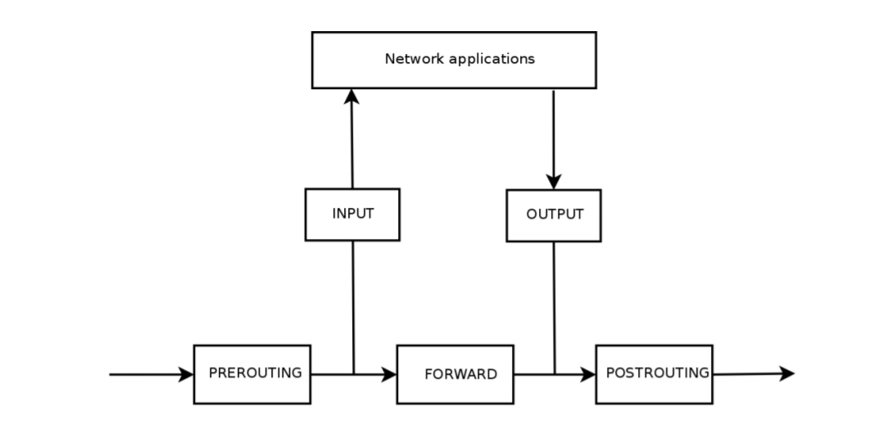
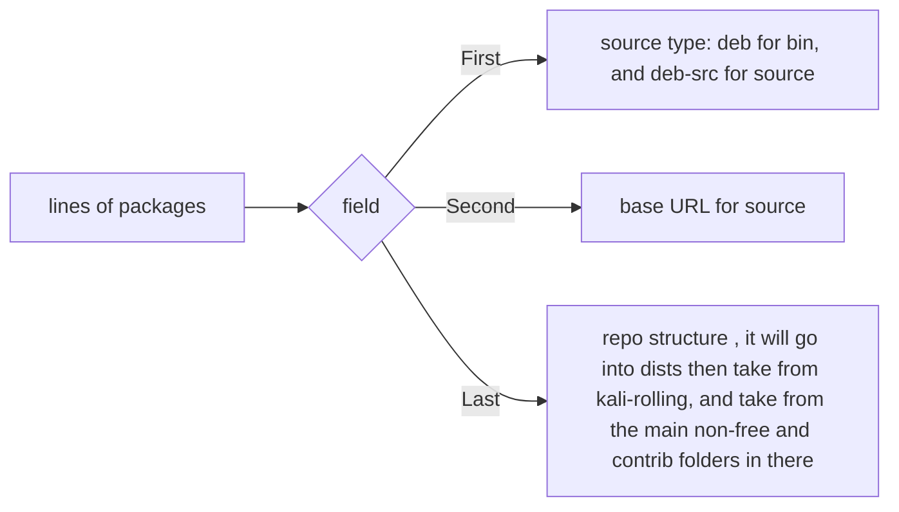
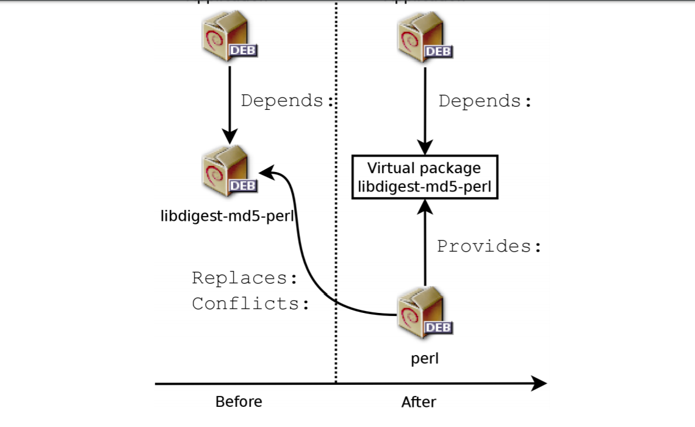

refer to page 22 to understand how the book is split up

# 1. About Kali Linux 

enterprise-ready security  auditing Linux distro 

__kernel__ - piece of software that handles interaction btwn hardware and end-user apps 

Kali started in 2012 because people wanted the OS to be mainline Linux 

GNOME is Kali Linux default desktop env 

Kali want latest Debian wanted stable 


## 1.2 Debian relatiionship 

    its based on the Debian Testing
    very independent from Debian 
    bunch of repos and bug fixing 


[Kali Package Tracker](http://pkg.kali.org/derivative/kali-dev/)
        follows difference from Debian 

    can be ported on several devices 

## 1.4 main features

* has 100's of programs 
* setup Kali as the main OS on any computer 
* has a live bootable system 
* can reboot a computer to kali 
* its kernel is up to date to provide all needed resources 
* customizable 
* kali is open sourced 
* can be deployed on any device 

## 1.5 Kali linux poliucy 

* single root user by default
* network ICMP  disabled by default 

# 2 Getting started 

## 2.1 download a trustworthy Kali ISO image 

www.kali.org/downloads 
MIRRORS for servers close to you 
➨ http://cdimage.kali.org/README.mirrorlist

* links are latest release, 
* devices with ARM processor -use  Linux armel or armhf 

32 or 64 bit 
* Windows- Accessories >System Tools folder > System Information >System Type
    
* Mac OS uname -m 

* Linux inspect the /proc/cpuinfo file with this command 
```
    $ grep -qP ’^flags\s*:.*\blm\b’ /proc/cpuinfo && echo 64-bit || echo 32-bit*
```


default and light 
* default -GNOME and all packages 
* light - Xfce and some for  resource-friendly 
* others use other desktop environments 

the actual download link is unprotected 
you need to make sure you have the right checksum
    trust HTTPS  
    they have a GnuPG key which you can use 
```
wget -q -O - https://www.kali.org/archive-key.asc | gpg --import
```
all options have limitations 


after the key you can verify the checksums 
```
$ wget http://cdimage.kali.org/current/SHA256SUMS
$ wget http://cdimage.kali.org/current/SHA256SUMS.gpg
gpg --verify SHA256SUMS.gpg SHA256SUMS
grep kali-linux-2017.1-amd64.iso SHA256SUMS | sha256sum -c
```
* if these dont add up you cant trust it

    
#### Creating a Windows bootable 
    grab your favorite software and go 
    Rufus industry-standard

#### Creating a Linux bootable 
* use the GNOME disks program 
* when linux kernel sees it it writes it name in the logs 
* __dmesg__ command to access 
* you will see [sdb] in the logs representing drive disk 
to copy the image 
```
dd if=kali-linux-light-2017.1-amd64.iso of=/dev/[parrtiton name if not sdb]
```

        
#### Creating the mac bootable 
to identify device 
```
diskutil list 
insert usb > diskutil list
note the /dev/disk[X]
```
unmonunt disk 
```
diskutil unmount /dev/disk6
```
execute dd
```
dd if=kali-linux-light-2017.1-amd64.iso of=/dev/disk6 bs=1M
```


## 2.2 booting an iso in live 

boot menu and boot 

__Virtual Box__ 
* x64 OS 
* need 1500 mb -2048 mb of ram
* choose hard disk, VDI 
* choose dynamically allocated storage 
* at least 20GB

for final config
* Settings > Storage >Storage Tree > Controller:IDE > Empty > Attributes > Optical Drive > Disk Icon 
> Choose Virtual Optical Disk File 
* Settings > System > Motherboard > 
> check floppy ,optical, hardrive
* Settings > System > Processor \
> enable PAE/NX if 32-bit

__VM Ware__ 
* Create New Virutal Machine  > Typcical
* Guest OS Installlation > Installer disc image file  > Select the image file > 

* VMWare should know 
    its Linux and Debian 8.x 

* Decide which folder to store the virtual machine

* Specify Disk Capacity > store over multiple files  

* Customize Hardware > Memory > 1500mb - 2048 mb 

* Power on Virutal Machine


# 3. Linux Fundamentals

What is Linux 
* its a conductor of an orchestra > its yr kernel > by bootloader > by BIOS 

Tasks handled by Linux kernel 
- it detects and configures hardware to be of use in the OS, it handles device specfifc details so you dont have to write them out in python. Zoom can use any webcam because it talks to the kernel video interface which handles it.
- exports data about detected hardware through /proc and /sys 
- apps access files using /dev 
    * /dev/sda - disk drive 
    * /dev/sda[number] - partition 
    * /dev/input/mouse0 - mice 
    * /dev/input/event0 - keyboard 
    * (/dev/snd/*) - sound cards 
    * /dev/ttyS* - serial ports 

- device files 2 types 
__block__ - finite and traversable 
__character__- stream, r/w only 


- identify a device file 
```
$ ls -l /dev/sda /dev/ttyS0
brw-rw---- 1 root disk 8, 0 Mar 21 08:44 /dev/sda   
crw-rw---- 1 root dialout 4, 64 Mar 30 08:59 /dev/ttyS0 
b for block 
c for character 
```

device commands 
    ioctl 
        
File System 
* one disk becomes root everyone else is mounted in /media 
* users accts, no matter where they are, mount at /home 
```
mkfs.ext3 [partition]
```

Processes 
* kernel is in charge of them 
* only one process runs at a time,    
* the kernel stops and starts process in milliseconds
    - except you have multi-core or hyper processor 

Command line 
* can access in terminal 
* can also access using CTRL +ALT +F1 - F6 if gui is broken, or omit CTRL 
* trailing $ or \# , awaiting input 
* $ -reg user 
* \# -superuser 

ENV 
* system-wide /etc/profile 
* per-user .profile 
* also in /etc/environment

        
#### File System 
consistent with the FHS 

• /bin/: basic programs
• /boot/: Kali Linux kernel and other files required for its early boot process
• /dev/: device files
• /etc/: configuration files
• /home/: user’s personal files
• /lib/: basic libraries
• /media/*: mount points for removable devices (CD-ROM, USB keys, and so on)
• /mnt/: temporary mount point
• /opt/: extra applications provided by third parties
• /root/: administrator’s (root’s) personal files 
• /run/: volatile runtime data that does not persist across reboots (not yet included in the FHS
• /sbin/: system programs
• /srv/: data used by servers hosted on this system
• /tmp/: temporary files (this directory is often emptied at boot)
• /usr/: applications (this directory is further subdivided into bin, sbin, lib according to
the same logic as in the root directory) Furthermore, /usr/share/ contains architecture independent data.
    The /usr/local/ directory is meant to be used by the administrator for
installing applications manually without overwriting files handled by the packaging system
(dpkg).
• /var/: variable data handled by daemons. This includes log files, queues, spools, and caches.
• /proc/ and /sys/ are specific to the Linux kernel (and not part of the FHS). They are used
by the kernel for exporting data to user space   

Home dir 

* lots of . files in the home dir, 
* Firefox leaves its downloads in cache a lot of storage space 
* FreeDesktop.org umbrella wants to clean this up 
    - ~/.config ,
    - ~/.cache .
    - ~/.local
        
Useful commands 

all files in directory
```
grep -r,
```
run a program in background 
```
[program name] & 
```    
to see a list of jobs 
```        
jobs 
```    
    
to bring a process back to the terminal
```
fg [job-number]                
```                

to unpause a background process 
```
bg [job-number] 
``` 


####   Managing rights

* setuid and setgid are file permissions that allow to any user as if they were user or group 
* you can do a buffer overflow on a setuid root prorgram and become root so look for these files 
* sticky bit, t only allows for owner or the owner of the parent dir to create or delete them   
* for chmod can use octal or use 
u=rwx,g+rw,o-x
* setuid,setgid,sticky bit 4,2,1 respective 

__umask__  - system removes these permissions when files are created 
* its a 4 digit octal number 
* default 0022 means remove write for group and other  
            
            
####    System info 

__free__ - displays mem info 
        
__df__ -display info about partitions and drives

__id__ - info about the whoami 

__uname -a__ 
    kernel name 
    machine type 
    OS name 

__dmesg__  - hardaware messages
* as a new USB device inserted,
* a failing hard disk operation, 
* or initial hardware detection on boo

__journalctl__ 
* -f stream of new log entries 
* -u limit messages from a system unit 
* -r newer messages shown first 

#### Discovering Hardware 

* __lspci__ -lists pci devices 
* __lsusb__ - lists usb devices 
* __lspcmcia__ - lists the pcmcia cards 
* __lsdev__- comm. resources by dev
* __lshw__ - combines above (good for hardware problems)


# 4 Installing Kali 

min req 
    CPU supports amd64,i386,armel,armhf,arm64 

#### installing 
* Isolinux boot loader menu >
install/ graphical install 
* select a language 
* select country 
* choose American English Keyboard 
* detects the bootloader 
* installer puts all its drivers in the bootloader 
* if it cant find the right module you choose one, or you download from removable drive 
* then it tries to perform DHCP 
    - netcfg/use_dhcp=false, when booting,edit with Tab Key > 
    add desired option >
    Press Enter 
enter admin password 
    __pwgen__ helps generate passwords
configure the clock 
    if theres a network system is updated with NTP
detecting disks 
    partitioning 
        use gparted 
    - Guided- installs Kali on the whole disk 
    Partition disks 
        - all files in 1 partition - makes the / and the swap for memory 
        - seperate /home - good if you have to reinstall the system 
        - seperate /home/, /var and /tmp partitons for servers  
            - daemon data and users cannot clog the rest of the system 
Partiton Map
    what the installer will do to the hard drive 
    Manual- page 
        - avail disks, parttions and free space 
        - new disks - new parttion table
        free space 
            new parttiton, 
            cylinder/head/sector info 
        New Partiton 
            - format 
            - swap 
            - encrpytion volume 
            - LVM volume 
            - RAID device 
            - do not use 

    Copying live  image
        places image on a partition

    Config package manager 
        - mirror http.kali.org, if no must be configured 
        - using a local mirror 
            at boot
```
mirror/http/hostname=my.own.mirror
```            
            
    HTTP proxy, 
        good for caching or else installer does direct access 

        Packages.xz and Sources.xz, to update /etc/apt/sources.list            

Installing GRUB bootloader 

what is it 
    loads linux kernel into memory and executes it 

where to put it 
- added to the MBR, fix GRUB config other OS can be booted 
- GRUB should be placed on boot drive
- windows reinstall, bootloader erased means kali is on the hard but no longer 
- accessible from the boot menu 
start Kali with rescue/enable=parameter to reinstall the bootloader 
➨ http://www.debian.org/releasesstable/amd64/ch08s07.html

Finishing Installation 

    cleanup and thats it 


Encrpyted Installation
    __LUKS__ - Linux Unified Key Setup, partiton encrypt 
    __LVM__ -   manage stroage dynamically

LVM 
    * virtual partiton, logical volume part of volume group  aka physical parttions 
    * LVM allows to make virtual partiton that spanes several disks 
    easy to modify 

LUKS 
* __dm-crypt__ driver uses yr device mapper to make it 
* needs swap to be encrypted because thats were the key is 

Setup   
* choose  Guided Partition with Encrpyted LVM 
* cant be booted or accessed 
* empty areas are given random data 
* used to split an encrpyted into multiple logical volumes, 
    not easy to extend size 
* Partitioning scheme 
        validate, confirm 

Continues as usual with apt     

- [x] its refereced /dev/vda 
- [x]its partiton /dev/vda[number]

#### Unattentded Installation 

how installer installs 

* modular, executes tiny scripts udeb, each rely on debconf 
* __debconf__ answers all the user input prompts 

boot params 
    debconf uses __/proc/cmdline__ 
    https://www.debian.org/releases/stable/amd64/apbs02#preseed-aliases

            
__preseed.cfg__ - write this at installers initrd(used to start installer)

With a Preseed File in the Boot Media
    /hd-media/preseed.cfg
    /cdrom/preseed.cfg
    preseed starts after language and country
            
from network
    preseed/url=http://server/preseed.cfg
    cant do this until network-related debconf is answered


to overcome the language limitation 
    auto-install/enable=true in your preseed source or kernel cmd,
    puts the language toward the end of debconf query 


for debconf to answer critical ??
    priority=critical

get answers provided to installer 
> debconf-get-selections --installer

get answers for other packeages 
> debconf-get-selections

[resources](http://d-i.alioth.debian.org/manual/en.amd64/apb.html)

            
#### ARM Installations 
for non laptop devices offensive security has [installation media](https://www.offensive-security.com/kali-linux-arm-images/) for them 

to install 
* download verify checksum 
* __unxz__ compress the .xz
* get a SD , micro SD or eMMC module 8GB
* > dd if=kali-image.img of=/dev/something bs=512k
* plug storage with the installer into the ARM device 
* uses the GUI, sniffer to find the dev IP 
* change root password generate new nost keys 
[dev specifc problems](http://docs.kali.org/category/kali-on-arm)

Troubleshoot
* the GUI is not helpful 
* installer has
```
ctrl -shift 
    graphical   f5 
    textual     f1
    logs        f4  
    shells      f2,f3 
the shell is limited 
```

what u can do in the shell 
* uses wget once the network is configured
* inspect files 
    /var/log
* /root is mounted on /target once partitioning is complete 
* Save Debug Logs 
    file a bug report with the installer logs 
    
# 5. Configuring Kali 

Config the network     

on Desktop

__network manager__ 
can create profiles modify network config 
handles connections with mobile broadband 
deals with many other network protocols 

__ifupdown__
* __/etc/network/interfaces__ config 
* __/etc/init.d/networking__  startup script 

* to bring a service up /down 
    > ifup/ifdown network-device  
                
* /etc/network/interfaces config 
```
auto [network-device]
iface  [network-device] inet/inet6 [type] 
```
* 1st - configure once its available 
* 2nd - configures interfaces

* wireless interface need the wpasupplicant package
```
iface wlan0 inet dhcp 
wpa-ssid MyNetowrk 
wpa-psk Plaintextpassword 
```

__systemd-networkd__ 
* universal unlike debian 
* very useful for virutal machines 
* lacks wireless support 
* disabled by default 
```
    # systemctl enable systemd-networkd
    # systemctl enable systemd-resolved
    # systemctl start systemd-networkd
    # systemctl start systemd-resolved
    # ln -sf /run/systemd/resolve/resolv.conf /etc/resolv.conf       
```
configure .network files into 
*   /etc
*   /var
*   /run 
        /systemd/network

file format 
* systemd.network(5)
* Match section indicates network interfaces

config applies to 

#### Managing Unix Users and Unix Groups

/etc/
* passwd,
* group,
* shadow,
* gshadow

adduser 
* config 
> /etc/adduser.conf 
* a sample user home directory 
> /etc/skel/
* if u add  a user to sudo they have full sudo priviliges 

getent 
> getent passwd kaliuser1 
            
modifying accts 
__passwd__ user changes passwd 
__chfn__ modifes GECOS general Information field 
__chsh__ - change shell, limited to /etc/shells unless root 
__chage__ - allows root  to change passwd expiration settings 
    
to enable/disasble an acct 
```
passwd -l user
passwd -u user 
```

unix groups 
* addgroup 
* delgroup
* groupmod 
* gpasswdgroup
* gpasswd -r group
            
if a user needs to change groups 
* newgrp
* sg 
* setgid, makes files created to belong * the right group 

#### Configuring Services 

unknown programs 

* __/usr/share/doc/package/README__ , overview of the program and many configs that would frustrate you otherwise 
* dpkg -L package - lists files included in package 
* dpkg -s package - display package metadata 
* config examples 
> /usr/share/doc/package/examples/ 
            
ssh 
* systemctl start/enable ssh 
* config 
    /etc/ssh/sshd_config
* systemctl reload ssh
* you want to reset your ssh keys passwd
[...]
# rm /etc/ssh/ssh_host_*
# dpkg-reconfigure openssh-server
# service ssh restart

postgresql 
* systemctl start
* can have several postgresql versions 
* /etc/postgresql/[version]/[cluster-name]/ 
new cluster get assigned next availble port ## 

* localhost TCP 5432 
* file-based socket  /var/run/postgresql/.s.PGSQL.5432 
* configured in postgresql.conf 
* pg_hba.conf
    whos allowed and authentication method 
* TCP has its own username and password 
postgres is the root postgres, used to make new users and databases 

users and dbs 
* createuser,dropuser,createdb,dropdb 
* each cluster is on a port 
* to create a role 
```
su - postgres
$ createuser -P king_phisher
Enter password for new role:
Enter it again:
$ createdb -T template0 -E UTF-8 -O king_phisher king_phisher
$ exit
```
                
to connect to postgres 
```
psql -h localhost -U king_phisher king_phisher
```    

Managing PostgreSQL Clusters
* pg_createcluster, pg_dropcluster,  
* pg_ctlcluster, pg_upgradecluster,
* pg_renamecluster, and pg_lsclusters.

* when PostgreSQL gets a major update it will create a new cluster that runs on the next port and you will use the old 
version until you migrate the databases from the old to the new 

* pg_upgradecluster old-version cluster-name 
* pg_dropcluster new-version cluster-name, then drop the original old cluster 


apache
* modular program 
* a2enmod module 
* a2dismod module
* toggle symlinks 
    /etc/apache2/mods-enabled/,
    /etc/apache2/mods-available/
            
ssl 
* since apache 2.4 
* /etc/apache2/sites-available/default-ssl.conf

* listens on port 80
* serves from /var/www/html 
* /etc/apache2/sites-enabled/000-default.conf


Config Virtual Hosts 
* Requests concerning unknown virtual hosts will always be served by the first defined virtual host
    
<VirtualHost *:80>
ServerName www.example.com
ServerAlias example.com   
DocumentRoot /srv/www.example.com/www
</VirtualHost>    


Common Directives 
* you have directory blocks 

<Directory /var/www>
Options Includes FollowSymLinks
AllowOverride All
DirectoryIndex index.php index.html index.htm
</Directory>    

__Directory__ - list of files to try when user matches directoy 

__Options__ list of options to enable 
    None all values accordingly 
    * __ExecCGI__ - indicates CGI scripts are  executed 
    * __FollowSymLinks__ 
    * __SymLinksIfOwnerMatch__  - and that the targets exist 
    __Includes__ - enables SSI, embeded in HTML pages 
    __Indexes__ - tells the server to list to the contents of the directory 
    __MultiViews__- enables content negotation 

authentication
    .htaccess - where directives are stored 
    restrict ExecCGI , so users can't do things as www-data 

non secure base64 encrpytion 
* Require valid-user
* AuthName ”Private directory”
* AuthType Basic
* AuthUserFile /etc/apache2/authfiles/htpasswd-private

to change web users passwords 
* htpasswd /etc/apache2/authfiles htpasswd-private user


Restricting  
    Require directive
        Require ip 192.168.0.0/16

#### Managing services 

    init and full control system- systemd 

    systemctl 
        lists units, services are a part  

service   
service units in files described in 
* /lib/systemd/system/ (or 
* /run/systemd/system/, or 
* /etc/systemd/system/
* managed by [service-name].service.d/*.conf  files 
```
[Unit]
Description=OpenBSD Secure Shell server
After=network.target auditd.service
ConditionPathExists=!/etc/ssh/sshd_not_to_be_run
[Service]
EnvironmentFile=-/etc/default/ssh
ExecStart=/usr/sbin/sshd -D $SSHD_OPTS
ExecReload=/bin/kill -HUP $MAINPID
KillMode=process
Restart=on-failure
RestartPreventExitStatus=255
Type=notify
[Install]
WantedBy=multi-user.     
```

__target units__ -they group dependencies on a service so a service can do more     
systemctl enable foo.service 
    system starts enables units required to reach the default target ,symlink to the graphical target, depends on multi
    user target 
when you enable a service systemd  adds dependencies on targets in WantedBy entry of the [Install]
section of the service unit file 
commands 
    enable and disable only decide what happens at next boot     


# 6. Helping yourself and getting help 

## 6.1 Man Pages 

* man manual-page aliases
* there is also yelp (GNOME), konqueror (KDE) for a GUI 
* organization
    - 1 Commands that can be executed from the command line
    - 2 System calls (functions provided by the kernel)
    - 3 Library functions (provided by system libraries)
    - 4 Devices (on Unix-like systems, these are special files, usually placed in the /dev/ directory)
    - 5 Configuration files (formats and conventions)
    - 6 Games
    - 7 Sets of macros and standards
    - 8 System administration commands
    - 9 Kernel routines    

    to specify 
        man [number] [command]


## 6.1 Info Documents 

* GNU project has docs in info format but you are good to use __pinfo__ 
* info page is english only, when something is not availble in info you get the man page


### 6.1.3 Package specifc documentation 

* found in __/usr/share/doc/package/__ 
* if doc is large, the main doc will refer you where to find it 
also has debian helpers
* README.Debian every characteristic you need to know of the name 
* changelog.Debian.gz allows user to follow modifications made to debian over time
* NEWS.Debian.gz documents major changes that concern the administrator 


### 6.1.4 Websites 
use your system specs to limit your search 


### 6.1.5 [Kali Documentation](http://docs.kali.org) 

step  by step 
how to documentation

    Topics include
* getting started 
* use Kali as a live system 
* installing - dual boot, special hardware
* kali and ARM 
* using it do get shit done
* tinkerers 
* community support 
* what makes kali special 
* Kali Dojo :  Black Hat and DEF CON workshops

## 6.2. Kali Linux Communities

### 6.2.1. [Web Forums](https://forums.kali.org)

### 6.2.2. #kali-linux IRC Channel on Freenode
port 6667- encrypted 
port 6666 - free text 
need hexchat,irssi, https://webchat.freenode.net


## 6.3. Filing A Good Bug Report 

###  6.3.1. Generic Recommendations

* write in english 
* Explain what you were trying to do and how you expected the program to behave.
    - mabye you were not supposed to use it that way 
* long is better 
* using the latest version 
* one bug report per issue 
 
### 6.3.2. Where to File a Bug Report

* track the problem to the source file, use __dpkg__ to find out which package owns it  
* if u cant track packge get in touch with Kali Support Forum 
                
#### Example 

    $ dpkg -S /usr/bin/sparta
    sparta: /usr/bin/sparta
    $ dpkg -s sparta | grep ^Version:
    Version: 1.0.1+git20150729-0kali1

* since it has kali in the string , it modifies by kali
* no kali string comes from  debian 
* since kali does modification see if it works in a [debian vm](https://www.debian.org/devel/debian-installer/)
if you dont know (say an integration problem) file on both sides and cross reference 

> to find where to file a bug report 
    --------------------------------------------
    $ dpkg -s sparta | grep ^Homepage:
    Homepage: https://github.com/SECFORCE/sparta

### 6.3.3. How to File a Bug Report

#### Kali 
http://bugs.kali.org

#### Debian 
__Debbugs__ email based
allocates a bug number tells you reach out to 
XXXXXX@bugs.debian.org.
also check 
https://bugs.debian.org/package 
https://bugs.debian.org/XXXXXX


#### Setting Up Reportbug 
use it to send emails to debian 

#### Git hub is a famous one 

# 7 Securing and Monitoring Kali Linux

## 7.1. Defining a Security Policy

#### ask questions about the system 
- what are u trying to protect 
- what are you trying to prevent from occuring 
- who is the enemy

> Bruce Schneier "security is a process not a product "

- if a fort to protect a  calculator, u dont need it
-  sensitive stuff should only be reached by miimal ports
- there should be subsystems seperate from each other 
- linux kernel has a firewall

## 7.2. Possible Security Measures

### 7.2.1. On a Server

- change default passwords
- set strong passwords 
- __fail2ban__  prevent brute force passwd attacks 
- host over HTTPS


### 7.2.2. On a Laptop

-  laptop can be stolen or seized by customs 
- Full Disk Encryption 
- setup nuke feature 
- firewall in order not to give up customer IP info 
- reduce the noise you make on the network 


## 7.3. Securing Network Services
* disable the ones you do not use 
    - no firewall by default 
    - no authentication credentials 
    - some run as root 

## 7.4. Firewall or Packet Filtering

- there are filtering network gateway 
- __netflier__ firewall  linux kernel uses  
- __iptables__, __ip6tables__, __fwbuilder__ and commands use in parallel it manages 
    netflier 
  

## 7.4.1. Netfilter Behavior
* uses 4 distinct tables 
    - each 3 kinds of operations on packets 
        * __filter__ accept, refuse or ignore a packet
            __chains__
            - INPUT - packet firewall dest
            - OUTPUT - firewall emitted packets
            - FORWARD - packets making a pitstop at the firewall 
        * __nat__ (Network Address Translation) source,dest and ports for the packet 
            __chains__
            - PREROUTING: to modify packets as soon as they arrive;
            - POSTROUTING: to modify packets when they are ready to go on their way;
            - OUTPUT: to modify packets generated by the firewall itself        
        * __mangle__ concerns other changes to IP packets (wireshark shit ) 
            - refer to man iptables and ip6tables for more info 
        * __raw__ other manual modifications before they reach connection tracking system 

* __chains__ list of rules each table contains
    - there are standard chains and ones root can create
    - how_netflier_chains_are_called
    
    - in each chain there are a set of actions to perform 
    
    ACCEPT - allow to go on its way 
    REJECT - with ICMP error packet 
    DROP -delete packet 
    LOG - via syslogd a message describing it
        --log-level 
        -- 
    ULOG - via ulogd better at dealing with larger loads 
    RETURN - interrupt current chain and go to calling chain 
    SNAT - (only in nat table) Source Network Address Translation
    DNAT - y Destination Network Address Translation
    MASQUERADE - apply SNAT spoofing 
    REDIRECT - how you can act as a proxy but do some MITM 

> IPv6 needs ICMPv6, but IPv4 doesnt need ICMP 


### 7.4.2. Syntax of iptables and ip6tables

-t --table, which table to operate (default filter)
-n -L [chain]  list chains 
-N [chain] creats new chain 
-X [chain] deletes an empty and unused chain 
-A [chain] adds rule at the end of the given chain
-I [chain] [rule_num] - inserts rule before [rule_num]
-D [chain] [rule_num] - deletes a rule in the chain 
-F [chain] - deletes all its rules 
-P [chain] [action] - default action for the given chain 

### Rules 

exprressed as 

```python
conditions -j action action_options
```
if you have several conditions, they all must be true
* -p [protocol], tcp, udp, icmp, and icmpv6 
with some  --source-port port and --destination-port port options 
Prefixing a condition with an exclamation mark negates the condition.
* -s -d [address] [network-mask], respectively 
* -i ,-o [interface] going and leaving a specific interface respectively 
* --state [state] state of packet in connection 
NEW 
ESTABLISHED 
RELATED 

> Examples 
```
$ iptables -A INPUT -s 10.0.1.5 -j DROP
$ iptables -A INPUT -s 31.13.74.0/24 -j DROP
$ iptables -n -L INPUT
Chain INPUT (policy ACCEPT)
target prot opt source destination
DROP all -- 10.0.1.5 0.0.0.0/0
DROP all -- 31.13.74.0/24 0.0.0.0/0
```

```
# iptables -A INPUT -m state --state NEW -p tcp --dport 22 -j ACCEPT
# iptables -A INPUT -m state --state NEW -p tcp --dport 80 -j ACCEPT
# iptables -A INPUT -m state --state NEW -p tcp --dport 143 -j ACCEPT
# iptables -n -L INPUT
Chain INPUT (policy ACCEPT)
target prot opt source destination
DROP all -- 10.0.1.5 0.0.0.0/0
DROP all -- 31.13.74.0/24 0.0.0.0/0
ACCEPT tcp -- 0.0.0.0/0 0.0.0.0/0 state NEW tcp dpt:22
ACCEPT tcp -- 0.0.0.0/0 0.0.0.0/0 state NEW tcp dpt:80
ACCEPT tcp -- 0.0.0.0/0 0.0.0.0/0 state NEW tcp dpt:143
```

dropping rules (this will renumber the list )
```
# iptables -n -L INPUT --line-numbers
Chain INPUT (policy ACCEPT)
num target prot opt source destination
1 DROP all -- 10.0.1.5 0.0.0.0/0
2 DROP all -- 31.13.74.0/24 0.0.0.0/0
3 ACCEPT tcp -- 0.0.0.0/0 0.0.0.0/0 state NEW tcp dpt:22
4 ACCEPT tcp -- 0.0.0.0/0 0.0.0.0/0 state NEW tcp dpt:80
5 ACCEPT tcp -- 0.0.0.0/0 0.0.0.0/0 state NEW tcp dpt:143
# iptables -D INPUT 2
# iptables -D INPUT 1
# iptables -n -L INPUT --line-numbers
Chain INPUT (policy ACCEPT)
num target prot opt source destination
1 ACCEPT tcp -- 0.0.0.0/0 0.0.0.0/0 state NEW tcp dpt:22
2 ACCEPT tcp -- 0.0.0.0/0 0.0.0.0/0 state NEW tcp dpt:80
3 ACCEPT tcp -- 0.0.0.0/0 0.0.0.0/0 state NEW tcp dpt:143

```

####  Creating Rules

use __fwbuilder__ package to get it done
1. describe everything invloved in actual rules 
• The firewall itself, with its network interfaces
• The networks, with their corresponding IP ranges
• The servers
• The ports belonging to the services hosted on the servers
2. create the rules with drag and drop options 
- smart to write scritps for iptables for Linux, ipf for FreeBSD, and pf for OpenBSD.
- you can do seperately for IPv4 & IPv6 


### 7.4.4. Installing the Rules at Each Boot

after each boot you need to register  the configuration script in an up directive of the /etc/network/interfaces

its using ifupdown to execute a script after the interface has been brought up
    
```sh
cat /etc/network/interfaces
auto eth0
    iface eth0 inet static
    address 192.168.0.1
    network 192.168.0.0
    netmask 255.255.255.0
    broadcast 192.168.0.255
    up /usr/local/etc/arrakis.fw
```

## 7.5. Monitoring and Logging

make sure the service is availble and working 

### 7.5.1. Monitoring Logs with logcheck

the program monitors log everyhour by defaults and sends unusual stuff to the admin  

__/etc/logcheck/logcheck.logfiles__ - list of monitored files only if /etc/rsyslog.conf has not been overhaulded 
- can report in paranoid, server(details),workstation 
- complex selection mechanism 

##### Types of Rules 
• those that qualify a message as a
cracking attempt  (stored in a file in the /etclogcheck/
cracking.d/ directory);
• ignored cracking attempts (/etc/logcheck/cracking.ignore.d/);
• those classifying a message as a security alert  (/etc/logcheck/violations.d/);
• ignored security alerts (/etc/logcheck/violations.ignore.d/);
• finally, those applying to the remaining messages  (considered as system events).

ignore.d - used to ignore messages 
system event always signalned unless a rule states to ignore it 


### 7.5.2. Monitoring Activity in Real Time
use __top__ its GUI is gnome-system-monitor

m - memory use sort 
t - processor time 
n - process identifier (used to changed max tasks)


- [x] if you see a strange process running as 'www-data' web app exploit 

### 7.5.3. Detecting Changes
system files should stay the same until you get a dist-upgrade 

__dpkg --verify__ uses hashes on disk , but smart attacker can get to your hashes

```
here c means conf file change, the lib means code was modifed instead of using the conf file to do so 
# dpkg -V
??5?????? /lib/systemd/system/ssh.service
??5?????? c /etc/libvirt/qemu/networks/default.xml
??5?????? c /etc/lvm/lvm.conf
??5?????? c /etc/salt/roster
```

__Monitoring Files: AIDE Advanced Intrusion Detection Environment__
-  daily system snapshot and does comparison checks
-  get a read-only storage media so attackers cant go in and replace the system snapshots 
- read the conf syntax in man aide.conf 
- __tripewire,Samhain__ are some tools that the same and more, use them 
- [x] the packages wont catch attakers 100% but help you figure it out 

# 8 Debian Package Management
got to know when not to get yourself in a configure make gcc, gdb problem 
debian and kali are different and not every debian package will work properly in kali

## 8.1. Introduction to APT

### 8.1.1. Relationship between APT and dpkg
__debian package__ compressed archive of software information
__binary package__ - files that can be directly used
__soruce package__ -source code and instructions to build binary

__dpkg__ 
only  knows what is installed on the system and whatever you provide on the command line, but knows nothing of the other available package

__apt__ 
installs a packages and does well  to resolve all the dependiences recursively 

gcc,make and compile, the program would always fail because of a missing dependency 

## Understanding APT
__/etc/apt/sources.list__ - a list of package sources where APT retrieves a package

#### 8.1.2. Understanding the sources.list File

/etc/apt/sources.list & sources.list.d/*

```
# deb cdrom:[Debian GNU/Linux 2016.1 _Kali-rolling_ - Official Snapshot amd64 LIVE/
➥ INSTALL Binary 20160830-11:29]/ kali-rolling contrib main non-free

# Main Kali repository
deb http://http.kali.org/kali kali-rolling main non-free contrib
```



-[x] for cd-rom: source yyou need apt-cdrom
​
__main__ -  fully comply with the  
[Debian Free Software Guidelines](https://www.debian.org/social_contract#guidelines) 

__non-free__ - does not conform but ok 


__contrib__ - need some 3rd party to run 

#### 8.1.3. Kali Repositories

__Kali-Roling__ the one made for end users updated everyday

__Kali-Dev__ - where Kali devs fix package problems, has the latest new-out-the-box updates

__Kali-Bleeding-Edge__ - as soon as Kali fixes a reported bug they place it here 
* 1they are not tested so APT marks as "watch out" when doing dist-upgrade 
keep it away from main sources.list 

- [x] if you a mirror problem 
```
curl -sI http://http.kali.org/README
HTTP/1.1 302 Found
Date: Mon, 11 Apr 2016 09:43:21 GMT
Server: Apache/2.4.10 (Debian)
X-MirrorBrain-Mirror: ftp.free.fr
X-MirrorBrain-Realm: country
Link: <http://http.kali.org/README.meta4>; rel=describedby;
➥ type=”application/metalink4+xml”
Link: <http://ftp.free.fr/pub/kali/README>; rel=duplicate;
➥ pri=1; geo=fr
Link: <http://de-rien.fr/kali/README>; rel=duplicate; pri=2;
➥ geo=fr
Link: <http://ftp.halifax.rwth-aachen.de/kali/README>; rel=
➥ duplicate; pri=3; geo=de
Link: <http://ftp.belnet.be/kali/kali/README>; rel=duplicate;
➥ pri=4; geo=be
Link: <http://ftp2.nluug.nl/os/Linux/distr/kali/README>; rel=
➥ duplicate; pri=5; geo=nl
Location: http://ftp.free.fr/pub/kali/README
Content-Type: text/html; charset=iso-8859-1

```

* kali iso 
➨ http://cdimage.kali.org

* to look at mirror
➨ http://http.kali.org/README.mirrorlist
➨ http://cdimage.kali.org/README.mirrorlist,
- [x] some countries wont let you see it

## 8.2. Basic Package Interaction

### 8.2.1. Initializing APT

apt was design to overcome flaws of apt-get, but it must be the other way around, 
download with apt update, CD/dvd/usb are much faster

### 8.2.2. Installing Packages

#### *dpkg*
```
# dpkg -i man-db_2.7.0.2-5_amd64.deb
```

--install actually does --unpack and --configure seperately
* __processing  triggers__ when a pacakges modifies files in monitored directories 
* dpkg will fail to install a package and return an error but you can use
--force-overwrite 
* if dpkg encounters a file installed by another file dpkg will refuse to install it, use that --force-overwrite fn if u think yr system will be ok 


#### *APT*
* lots of *dpkg-behind-the-scenes*
also apt-get aptitude install

* several- distros 
apt install [package=version]

* to force overwrite 
apt -o Dpkg::Options::=”--force-overwrite" install zsh

### 8.2.3. Upgrading Kali Linux

* to update kali
    > apt-get upgrade, aptitude safe-upgrade 

- [x] apt-get wont install packages that were not installed beforehand 

- apt uses most recent version ## 

- to use a specific distro
    > -t,--target-release 
    apt -t kali-rolling upgrade

- to set default option 
    > APT::Default-Release ”kali-rolling”; in the file /etc/apt/apt.conf.d/local

- to change the OS to a new major distro 
    > apt ,aptitude full-upgrade , apt-get dist-upgrade
    removes obsolete packages or
    install new dependencies

- __apt-listchanges__ helps to see problems before you do any upgrades 
refer to NEWS.Debian 

- update only when you have security bugs 
- dont when u have a presentation 
- package mixup 
- full-upgrade tells u it will toss yr work 
- kali, update once a week 

### 8.2.4. Removing and Purging Packages

__dpkg__ -r, --remove 

but all the config files, maintainer scripts, logs, dependencies still there for easy reinstall

* to remove all data, and user data 
    > dpkg -P package


__apt__ only removes dependencies 

apt install package1 package2- , to uninstall  packages with (-)
apt remove package1+ package2 tp install packages with (+)

* to remove all data, and user data 
    > apt -o Dpkg::Options::=”-P"   package


### 8.2.5. Inspecting Packages

#### Querying dpkg’s Database and Inspecting .deb Files

* theres a dpkg database
* its at */var/lib/dpkg/info*
* list of files installed */var/lib/dpkg/info/\*/list*
* status  */var/lib/dpkg/status*

* --listfiles package (-L), files installed by specified package 

* dpkg -S,--search [File]
searches for file then searches for pacakges it belongs to 

* dpkg --status,-s [package]
displays headers of installed package 

* dpkg --contents,-c [file.deb] lists contents in a .deb

* dpkg --info [file.deb] (or -I) 
headers for .deb file 

* dpkg --compare-versions 1.2-3 gt 1.1-4
with strings
replace
2.6.0pre3-1
with   
2.6.0~pre3-1 

#### Querying the Database of Available Packages with apt-cache and apt

- [x] apt does caching and you should clear out packages in /var/lib/apt/lists/ the /var/cache/apt/archives/ by using __apt ,apt-get clean__ entirely empties the directory
__apt ,apt-get autoclean__ only removes packages not in the mirror 


config param __APT::Clean-Installed__ keeps your .deb  files

__axi-cache__ is a better program

> apt-cache search [keyword]
gives a whatis 

> apt-cache show [keyword]
gives a lot of metadata 

less used, but useful

> apt-cache policy
priorities of package sources

> apt-cache dumpavail
display headers for all availble package versions 

> apt-cache pkgnames 
names all of packages at least once in the cache 


### 8.2.6. Troubleshooting

#### Handling Problems after an Upgrade

> Bug Reports

[Kali Bug Tracker](http://bugs.kali.org/)
[Debian Bug Tracker](https://bugs.debian.org/)

*  recompile  
* users posted workarounds 
* Downgrade 
    Kali-roling theres usually one package version

try to find the .deb package and install with dpkg check in  

*  /var/cache/apt/archives/
* __pool__ directory in your kali mirror
*  http://snapshot.debian.org if it was debian 

#### Dealing with Broken Maintainer Scripts

usually __postinst__ script fails 
* edit the script 
* maintainer scripts stored in __/var/lib/dpkg/info/__

add 
```
#!/bin/sh
set -x
```
```terminal
dpkg --configure -a 
```
-a means postinstall to see what going on 
- [x] not for preinstall since package is not in its final location.
- [x] for postrm and prerm, you need to do a package removal to execute 

#### The dpkg Log File

> all of its actions very verbose
/var/log/dpkg.log

#### if you damage a package
 
* apt,apt-get,aptitude --reinstall  [package]
* if you do install dpkg sees its there and will say no 
* do use reinstall, attackers might have modified apt or dpkg 

#### Leveraging --force-* to Repair Broken Dependencies

if there is a missing dependency or a broken package apt wont do anything. apt wants the system to be in a consistent state 

modify /var/lib/dpkg/status
* in order for apt to stay in an unconsistent state 
* __backports__ newer version recompiled to run in older env.

### 8.2.7. Frontends: aptitude and synaptic

APT is a C++ program from the *libapt-pkg* shared library. shared libraries are easier to make GUI's from 

#### Aptitude

has packages in a tree structure 
__+__ mark  for install
__-__ mark to remove 
__\___ to purge
__u__ - update 
__shift__+u global system upgrade 
__g__ summary view 
__gg__ apply changes

Aptitude full manaul you must use - file:///usr/share/doc/aptitude/html/en/index.html

> to search for a package 
~d description
~s section
~l limit 
the enter / then pattern 

you can use aptitude tools inside the command line 

on upgrade the recommended package will be listed so the admin can select it 

aptitude is better then apt at solving problems, but you still get to manually choose what to do 


> aptitiude's log
/var/log/aptitude - contains history about system wide changes, not trustworthy 

#### Synpatic 
full fledged GUI 
make aptitude simple 

## 8.3. Advanced APT Configuration and Usage

### 8.3.1. Configuring APT

> apt's config 
/etc/apt/apt.conf.d/
latter alphabet files config the first ones 

- [x] if there is a command to reset the conf watch for your manual changes, at the same time watch for the command for the package to see yr conf changes

 - can add directives in on of the apt.conf.d, usually named local or 99local 

Dpkg::Options {
”--force-overwrite”;
}

> Some directives 
Acquire::http::proxy ”http://yourproxy:3128”
Acquire::ftp::proxy ”ftp://yourproxy”


### 8.3.2. Managing Package Priorities
  
each has a priority of 100
A noninstalled version has a priority of 500

modify 
add entry in __/etc/apt/preferences__
* affected,version,origin,new priority

| Priority      | Action        |
| ------------- | ------------- |
| <0             | Never Be Installed  |
| 0-100  | Installed if no version is installed  |
|100-500| installed if no other new or availble in  another distro|
|501-990|installed if no newer version or one availble in the target distro |
|990-1000|installed except the installed version is newer|
|>1000|installs it no matter what|

* packages from debian experimental and kali bleeding-edge are given a priority of 1 to change give an entry in /etc/apt/preferences
```
Package: *
Pin: release a=kali-bleeding-edge
Pin-Priority: 500
```

more ex 

```
Package: *
Pin: release o=Kali
Pin-Priority: 900
Package: *
Pin: release o=Debian
Pin-Priority: -10
```

to ensure a version is not chaged 
```
Package: perl
Pin: version 5.22*
Pin-Priority: 1001
```

more info 
> man apt_preferences

### 8.3.3. Working with Several Distributions

apt install package/
unstable installs from debian/unstable 
-t flag to fix things


> Example 

install a v1
```
a v1 *Kali-Rolling* = 990
a v2 *Kali Dev* = 500
a v3 *Kali Unstable* = 500
```
kali keeps v1 

install a v2 

```
a v1 *Kali-Rolling* = 990
a v2 *Kali Dev* = 500
a v3 *Kali Unstable* = 500
```

kali takes debian unstable 

to avoid this 

```
Package: *
Pin: release a=unstable
Pin-Priority: 490
```

### 8.3.4. Tracking Automatically Installed Packages

apt-mark auto   package
apt-mark manual package

for automatic removal of unessecary packages

aptitude markauto 
aptitude unmarkauto

* to see why 
aptitude why [package]
> apt,apt-get dont have this 

### 8.3.5. Leveraging Multi-Arch Support

only installs same *armhf* *arm64*
from dpkg --print-architecture

#### Enabling Multi-Arch

dpkg --add-architecture 
dpkg --remove-architecture,
only when all arch-specifc packages are gone 

* can install packages 
apt install package:[architecture]

#### Multi-Arch Related Changes

the __Multi-Arch: same__ header various architectures can be safely coinstalled


* must have names qualified w/ their arch.
* share files with other instace of same package 
* dpkg ensures all files are bit for bit identical
* must have same version 

dependency architecture
go over this again
* dependency can be weakened with __package:any__  , but foreign packages only satisfy with __Multi-Arch: allowed__

### 8.3.6. Validating Package Authenticity

Kali provides a tamper-proof seal 
woth cryptographic hashes and a signature.

signed file is in the Release file 
list of packages, Packages.gz, Packages.xz 
MD5, SHA1, and SHA256 hashes,

* trusted keys are managed by the __apt-key__ 
* only the offical Kali-keys for their mirrors are needed 
* kept up to date by *kali-archive-keyring*
* in /etc/apt/trusted.gpg.d
* Cautious administrators should therefore check the fingerprints of imported keys before trusting
them to install new packages:


* when 3rd party-package is added to sources.list, apt needs to be told to trust it 

* we need a public key (__key.asc__) to do this 

* to add it 
    > apt-key add < key.asc

* apt will then check the signatures before operation


## 8.4. Package Reference: Digging Deeper into the Debian Package System

* for any given .deb file 
    - __debian-binary__ - single version ## describing archive format
    - __control.tar.gz__ - contains meta-info
    - __data.tar.xz__ - contains the actual files to be installed


### 8.4.1. The control File

* location - control.tar.gz archive
* to see it - dpkg -I [command]
* contains vital info abt package

```
$ dpkg -I apt_1.4~beta1_amd64.deb control
Package: apt
Version: 1.4~beta1
Architecture: amd64
Maintainer: APT Development Team <deity@lists.debian.org>
Installed-Size: 3478
Depends: adduser, gpgv | gpgv2 | gpgv1, debian-archive-keyring, init-system-helpers (>=
➥ 1.18~), libapt-pkg5.0 (>= 1.3~rc2), libc6 (>= 2.15), libgcc1 (>= 1:3.0),
➥ libstdc++6 (>= 5.2)
Recommends: gnupg | gnupg2 | gnupg1
Suggests: apt-doc, aptitude | synaptic | wajig, dpkg-dev (>= 1.17.2), powermgmt-base,
➥ python-apt
Breaks: apt-utils (<< 1.3~exp2~)
Replaces: apt-utils (<< 1.3~exp2~)
Section: admin
Priority: important
Description: commandline package manager
This package provides commandline tools for searching and
managing as well as querying information about packages
as a low-level access to all features of the libapt-pkg library.
.
These include:
* apt-get for retrieval of packages and information about them
from authenticated sources and for installation, upgrade and
removal of packages together with their dependencies
* apt-cache for querying available information about installed
as well as installable packages
* apt-cdrom to use removable media as a source for packages
* apt-config as an interface to the configuration settings
* apt-key as an interface to manage authentication keys

```

#### Dependencies: the Depends Field
* list of conditions for the package to work correctly 
    - <<: less than;
    - <=: less than or equal to;
    - =: equal to (note that “2.6.1” is not equal to “2.6.1-1”);
    - \>=: greater than or equal to;
    - \>>: greater than.
* Depends doesn't like the use of parentheses for [logical comaparison](http://www.debian.org/doc/debian-policy/ch-relationships.html)
* __meta-packages__ empty packages to help group other packages

#### Pre-Depends, a More Demanding Depends

* means packaged must be conf. before pre-install 
* do as last resort

#### Recommends, Suggests, and Enhances Fields

* recommends - optimizes main package
* suggests- additional features
* enhances- a suggestion in a different cotext, ignored by apt and synaptic

#### Conflicts: the Conflicts Field
* conflicts shows whether package cannot be installed with another
* dpkg wont install unless new says it will replace the old

#### Incompatibilities: the Breaks Field

* package will break another. happens when updates are not backwards compat 

#### Provided Items: the Provides Field

__Virtual packages__ - they are only a means of identifying real packages based on common, logical criteria

* virtual package , using a virtual package to associate a generic
service with it 
    - so instead of say i need dep. a,b,c the package says, I need a mail client 
    __service__ 


* package replaces another but still satisfies dependecies as a substitution package 




in the image, perl 5.8 has the dep built in, so now apt can toss it once the legacy perl is removed

#### Replacing Files: The Replaces Field

* package has deps in another package but package can remove them
* when package names change, included in another or the maintainer distrib. bin. differently 
* all files in package replaced, packge is considered to be removed

### 8.4.2. Configuration Scripts

* different stages in processing a packagae 
* postinst, postrm, preinst, prerm
* $ dpkg -I /var/cache/apt/archives/zsh_5.3-1_amd64.deb | head

* preinst prior to package install
* postinst follows it
* prerm -  before package install
* postrm -  after package install

#### Installation and Upgrade Script Sequence

>  installation (or an update):
1. update- *old-prerm upgrade new-version*
2. update- *new-preinst upgrade old-version*
    first install -new-preinst install [old-verison] if installed & removed, not purged
3.  new packaged files are unpacked
4. update- old-postrm upgrade new-version
5. dpkg updates all data, and deletes backup
6. updates conf files
7. new-postinst configure lastversion-configured

>  removal 

1. prerm remove 
2. dpkg removes all files except conf
3.  postrm remove, #without purge it stops 
4. if purge, tosses everything then postrm purge 

package might require debconf, used to handle package conf questions

### 8.4.3. Checksums, Conffiles

* in the package you have a  ./md5sums, for every file invovled
* dpkg will generate it at installation time if it does not exist
* __conffiles__ conf to be changed by root, dpkg will try not to update those changes 
    - old stays as  .dpkg-old s
    - new stays as .dpkg-dist
    - for dpkg to do automatic
        - --force-confold
        - --force-confnew
        - --force-confdef
    - for dpkg to do manual 
        - --force-confask

    


 


aaaaaaaaaaaaaaaaaaaaaaaaaaaaaaaaaaaaaa
aaaaaaaaaaaaaaaaaaaaaaaaaaaaaaaaaaaaaa
aaaaaaaaaaaaaaaaaaaaaaaaaaaaaaaaaaaaaa
aaaaaaaaaaaaaaaaaaaaaaaaaaaaaaaaaaaaaa
aaaaaaaaaaaaaaaaaaaaaaaaaaaaaaaaaaaaaa
aaaaaaaaaaaaaaaaaaaaaaaaaaaaaaaaaaaaaa
aaaaaaaaaaaaaaaaaaaaaaaaaaaaaaaaaaaaaa
aaaaaaaaaaaaaaaaaaaaaaaaaaaaaaaaaaaaaa
aaaaaaaaaaaaaaaaaaaaaaaaaaaaaaaaaaaaaa
aaaaaaaaaaaaaaaaaaaaaaaaaaaaaaaaaaaaaa
aaaaaaaaaaaaaaaaaaaaaaaaaaaaaaaaaaaaaa
aaaaaaaaaaaaaaaaaaaaaaaaaaaaaaaaaaaaaa
aaaaaaaaaaaaaaaaaaaaaaaaaaaaaaaaaaaaaa
aaaaaaaaaaaaaaaaaaaaaaaaaaaaaaaaaaaaaa
aaaaaaaaaaaaaaaaaaaaaaaaaaaaaaaaaaaaaa
aaaaaaaaaaaaaaaaaaaaaaaaaaaaaaaaaaaaaa